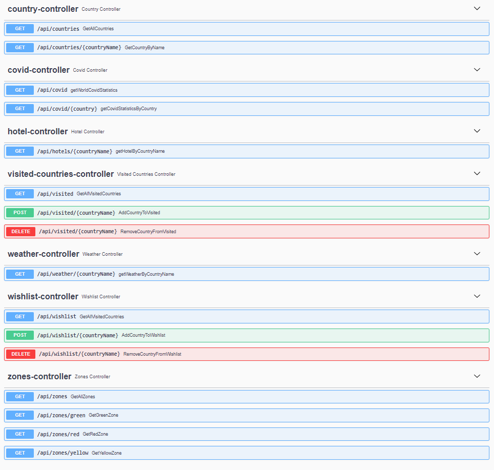

# TRAVEL COMPANION API
RESTful API that gives you the ability to store, manage "visited" and "want to visit" countries. API provides full
information about country (covid, hotels in capital, weather). Every country in "want to visit" can be divided into
three zones (red, yellow, green) according to new cases of covid in specified county.
## Swagger

## Authors
* Dainoras Žiukas - Developer
* Dominykas Pleteras - Quality Assurance Specialist
* Valdemar Subotkovski - Developer
## Tools
* jdk-11.0.9
* RapidApi
* Intellij IDEA
* dbForge MySQL
## Testing tools
* Swagger
* Postman
* Cucumber
* Soap UI